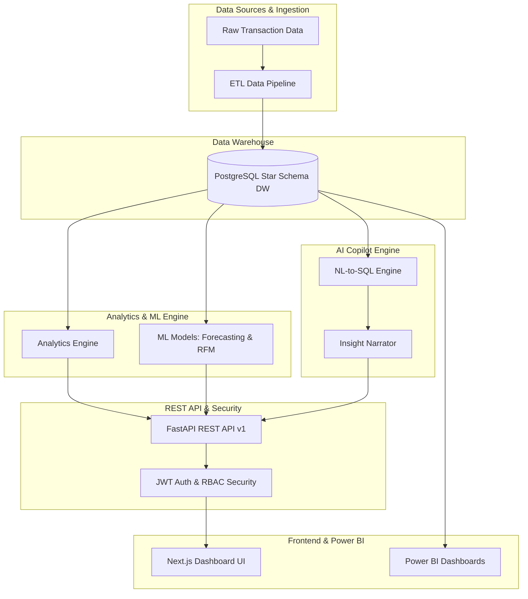

# InsightBI AI — AI-Powered Business Intelligence & Analytics Platform

[](https://www.python.org/)
[](https://fastapi.tiangolo.com/)
[](https://nextjs.org/)
[](https://www.postgresql.org/)
[](https://www.docker.com/)

**InsightBI AI** is an enterprise-grade, end-to-end AI-powered Business Intelligence & Analytics platform. It transforms raw business transaction data into clean analytical datasets, PostgreSQL star-schema data warehouse, Power BI dashboards, machine learning forecasts, RFM customer segmentations, automated PDF/CSV executive reports, and an interactive natural-language AI Analytics Copilot.

---

## 🌟 Key Platform Capabilities

### 1. Data Engineering & Star-Schema Data Warehouse
- **Automated Data Generators & Cleaning**: Synthetic transactional data generator producing 10,000+ orders across customers, products, and regional sales territories.
- **Dimensional Modeling**: Ralph Kimball star-schema structure (`dim_customer`, `dim_product`, `dim_region`, `dim_date`, `fact_sales`).
- **ETL Pipeline**: Idempotent data ingestion pipeline with validation, currency normalization, and automated table hydration.

### 2. Analytical Engine & Power BI Business Metrics
- High-performance analytics engine calculating Revenue, Net Profit, Profit Margin %, AOV, MoM Growth Rate, and Customer Retention.
- Power BI integration scripts including DAX metric measure handbook and Power Query M transform scripts.

### 3. Machine Learning Engine
- **Sales Forecasting**: `RandomForestRegressor` predicting 30-day regional revenue trends.
- **Customer RFM Segmentation**: `KMeans` clustering into 4 distinct segments (VIP / Champions, Loyal, Potential Loyalists, At-Risk / Lost).
- **Anomaly Detection**: `IsolationForest` detecting anomalous order volumes or transaction values.

### 4. AI Analytics Copilot
- Natural language query assistant converting plain English questions into safe SQL queries.
- SQL query sanitizer blocking destructive SQL (`DROP`, `DELETE`, `UPDATE`, `ALTER`, `TRUNCATE`).
- Executive narrative summary generator producing actionable business takeaways.

### 5. Production Next.js Dashboard Suite
- Dark-themed executive dashboard UI (`frontend/`) built with Next.js, React, TailwindCSS, and Recharts.
- 5 comprehensive views: Executive Overview, Sales Analytics, Customer RFM, Product Performance, and AI Copilot.

### 6. Enterprise Security & Reporting
- Role-Based Access Control (RBAC) supporting `Admin`, `Executive`, `Analyst`, and `Viewer` roles.
- Security audit log module (`logs/security_audit.log`).
- Automated PDF report exporter and CSV summary packager.

---

## 🏗️ Architecture Diagram



---

## ⚡ Quickstart Guide

### 1. Run Master Unit Test Suite
```bash
python scripts/run_all_tests.py
```

### 2. Start Local Development Environment
- **FastAPI Backend**:
  ```bash
  uvicorn backend.app.main:app --reload --port 8000
  ```
- **Next.js Frontend**:
  ```bash
  cd frontend
  npm run dev
  ```

### 3. Deploy via Docker Compose
```bash
docker-compose up -d --build
python scripts/verify_deployment.py
```

---

## 📖 Technical Documentation

- 📐 [System Architecture Guide](docs/architecture.md)
- 🗄️ [Data Warehouse & Schema Reference](docs/DATABASE.md)
- 📊 [Power BI & DAX Metrics Handbook](docs/POWER_BI.md)
- 🎯 [Power BI Portfolio Walkthrough](docs/POWER_BI_PORTFOLIO_GUIDE.md)
- 🤖 [Machine Learning & AI Copilot Technical Guide](docs/AI_ML.md)
- 🔌 [REST API Reference Guide](docs/API.md)
- 🐳 [Docker & Production Deployment Guide](docs/deployment.md)

---

## 📜 License & Author
- **Author**: Senior Data & AI Architect
- **License**: MIT License
