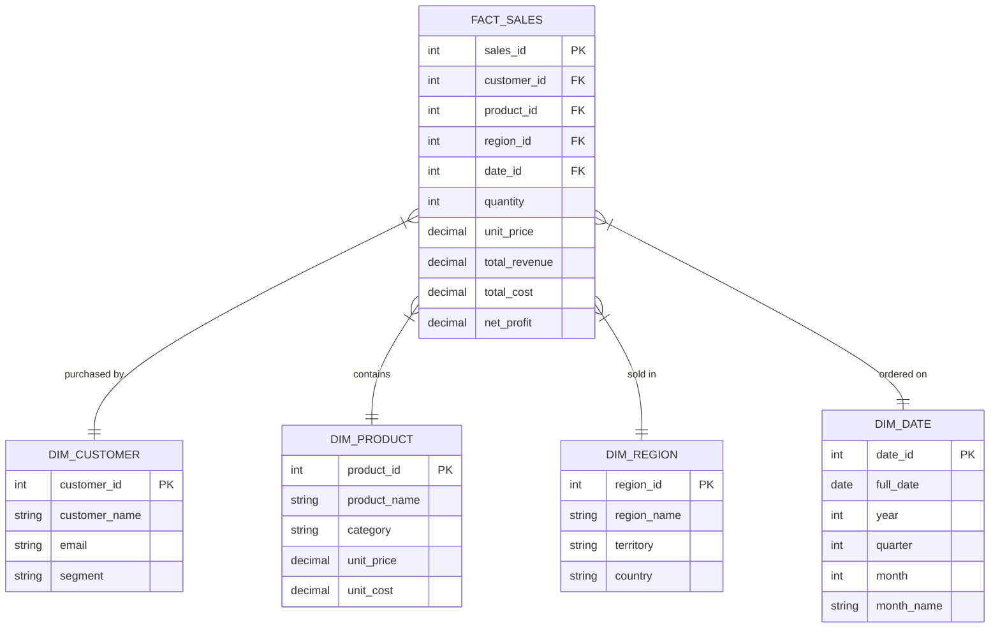

# PostgreSQL Data Warehouse & Star-Schema Specification

## Star Schema Overview
The InsightBI AI PostgreSQL data warehouse follows a Ralph Kimball dimensional modeling approach organized into 4 dimension tables and 1 central fact table.



---

## Table DDL Reference

```sql
-- Fact Sales Table
CREATE TABLE fact_sales (
    sales_id SERIAL PRIMARY KEY,
    customer_id INT REFERENCES dim_customer(customer_id),
    product_id INT REFERENCES dim_product(product_id),
    region_id INT REFERENCES dim_region(region_id),
    date_id INT REFERENCES dim_date(date_id),
    quantity INT NOT NULL,
    unit_price NUMERIC(12, 2) NOT NULL,
    total_revenue NUMERIC(14, 2) NOT NULL,
    total_cost NUMERIC(14, 2) NOT NULL,
    net_profit NUMERIC(14, 2) NOT NULL
);

CREATE INDEX idx_fact_sales_date ON fact_sales(date_id);
CREATE INDEX idx_fact_sales_customer ON fact_sales(customer_id);
CREATE INDEX idx_fact_sales_product ON fact_sales(product_id);
```
