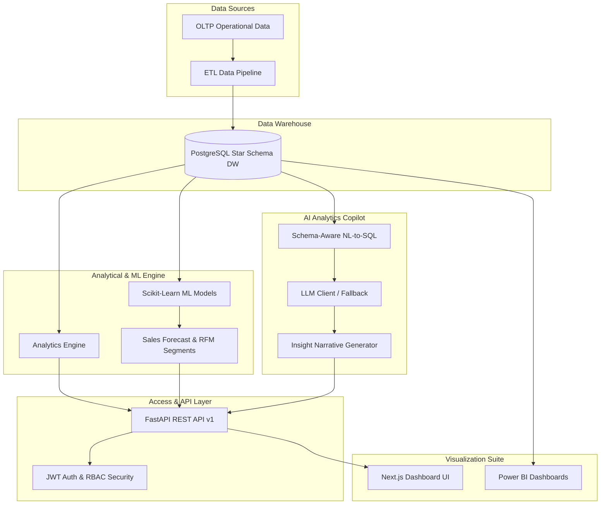

# InsightBI AI — System Architecture & Design Specification

## Overview
**InsightBI AI** is an enterprise-grade AI-powered Business Intelligence & Analytics platform designed to deliver real-time operational metrics, predictive analytics, natural language query copilot, and automated business insight generation.

---

## High-Level Architecture Diagram

---

## Component Specifications

### 1. Data Ingestion & ETL Pipeline (`etl/`)
- Clean, standardize, and validate raw CSV and relational data.
- Enforce business rules, currency normalization, and surrogate key assignment.
- Hydrate PostgreSQL star-schema dimension and fact tables (`dim_customer`, `dim_product`, `dim_region`, `dim_date`, `fact_sales`).

### 2. Analytical Engine (`analytics/`)
- Calculates business metrics (Revenue, Profit, Profit Margin %, AOV, Customer Retention).
- Provides aggregated SQL views and time-series rollup functions.

### 3. Machine Learning Engine (`ml/`)
- **Sales Forecasting**: `RandomForestRegressor` predicting 30-day regional and overall revenue.
- **Customer Segmentation**: `KMeans` RFM (Recency, Frequency, Monetary) clustering into 4 segments (VIP, Loyal, Potential, At-Risk).
- **Anomaly Detection**: `IsolationForest` detecting anomalous order volumes or transaction values.

### 4. AI Analytics Copilot (`ai_copilot/`)
- Converts natural-language questions to safe SQL queries.
- Includes strict regex query sanitizer blocking destructive SQL (`DROP`, `DELETE`, `UPDATE`, `ALTER`).
- Generates executive narrative summaries and actionable business takeaways.

### 5. FastAPI REST API (`backend/app/`)
- Production FastAPI framework with Pydantic request/response validation.
- JWT authentication, refresh token support, and Role-Based Access Control (`Admin`, `Executive`, `Analyst`, `Viewer`).

### 6. Next.js Frontend Dashboard (`frontend/`)
- Modern dark-themed dashboard built with Next.js App Router, TailwindCSS, and Recharts.
